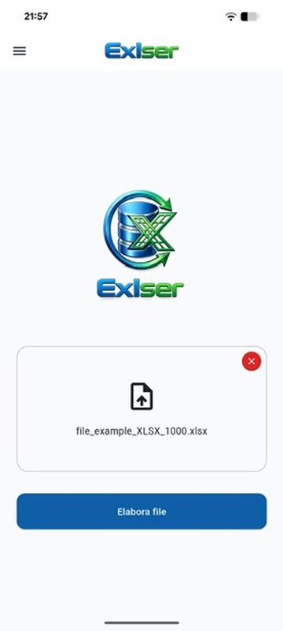
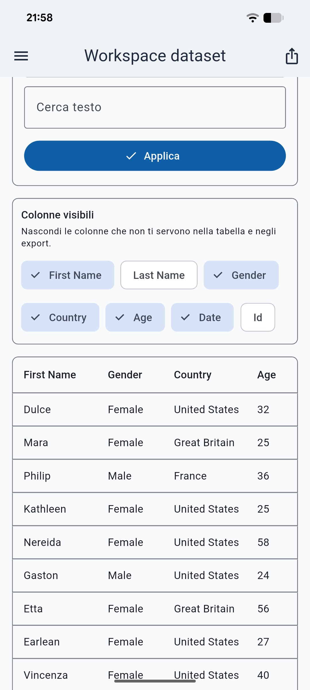
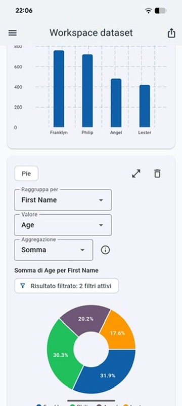
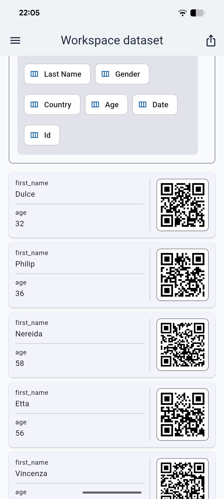
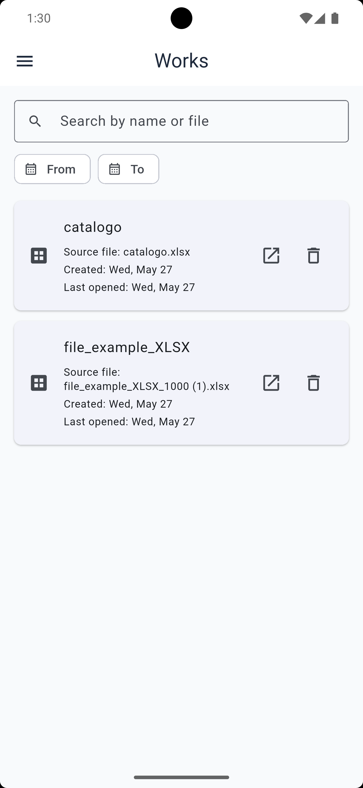
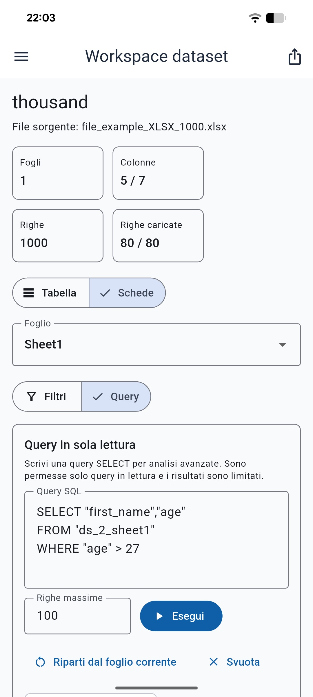
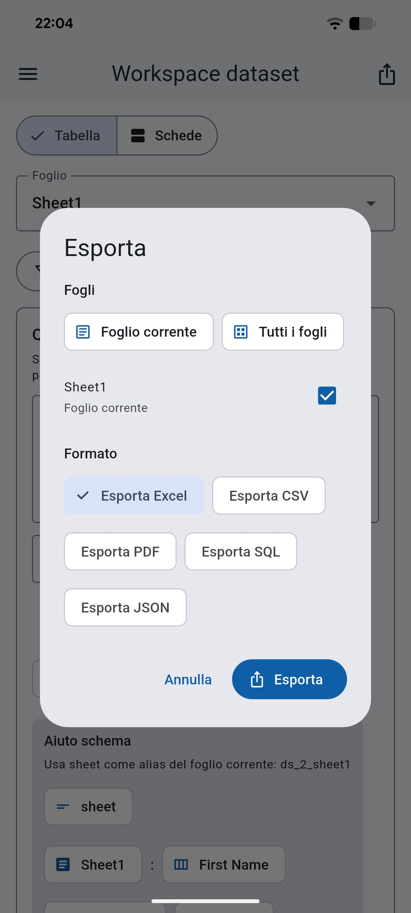
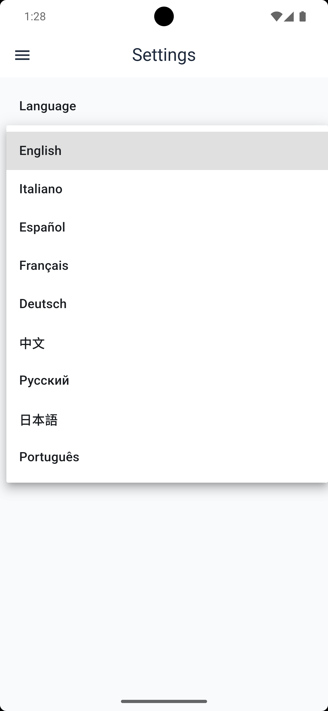

# Exlser

**Open your CSV or Excel files. Explore them like a database.**

Exlser is a cross-platform app that turns CSV and Excel files into persistent, queryable local datasets — with smart filtering, multi-format export, automatic chart suggestions, and a power-user SQL mode. No server. No cloud account. Everything runs on your device.

[](https://github.com/Pablo-gitub/exlser/actions)
[](https://flutter.dev)
[](#-supported-platforms)
[](ROADMAP.md)
[](LICENSE)
[](#-features)

---

<p align="center">
  
  
  
  
</p>

<!--
  🎬 VIDEO NEEDED — DEMO DEL CORE LOOP (30–60 secondi)
  Registrazione schermo che mostra l'intero flusso import → export:
    1. Trascina un file CSV o XLSX sull'app (o usa il file picker)
    2. Percorri il wizard schema (conferma i tipi colonna)
    3. Il dataset appare nella lista Works
    4. Apri il dataset — le righe caricano nella tabella
    5. Applica uno o due filtri
    6. Passa alla card view (si vedono i QR code)
    7. Apri analytics — un grafico si renderizza automaticamente
    8. Tap export → scegli PDF → il file viene salvato/condiviso
  Carica su YouTube, converti in GIF, o usa GitHub video embed.
  Sostituisci questo commento con:
    [](https://youtu.be/YOUR_LINK)
-->

---

## ✨ Features

| | Feature | Description |
|---|---|---|
| 📥 | **Import CSV & Excel** | Drag-and-drop or file picker. Multi-sheet XLSX supported. |
| 🧠 | **Schema inference** | Column types (text, number, date, boolean) detected automatically. Review and correct before saving. |
| 🗄️ | **Local persistence** | Datasets stored in SQLite. Reopen previous work at any time. |
| 🔍 | **Rich filtering** | 16+ type-aware operators: contains, between, before/after date, isEmpty, and more. |
| ↕️ | **Sort & paginate** | Single-column sort. Configurable page size for large datasets. |
| 👁️ | **Column visibility** | Hide columns not relevant to the current analysis. State is saved per sheet. |
| 🔁 | **Table & Card view** | Switch between a spreadsheet-style table and a per-row card layout. |
| 📊 | **Automatic charts** | Line, bar, and pie charts suggested from your column types. Configurable aggregations (COUNT, SUM, AVG, MIN, MAX). |
| 🔎 | **SQL query mode** | Write SELECT queries directly against your dataset. Read-only, schema-validated, with a built-in schema helper. |
| 📤 | **Multi-format export** | Export to Excel, CSV, PDF, SQL INSERT statements, or JSON — respecting active filters and column visibility. |
| 🧾 | **PDF with QR codes** | Card-layout PDF embeds a per-row JSON QR code, scannable from any mobile device. |
| 🌍 | **9 languages** | English, Italian, Spanish, French, German, Chinese (Simplified), Russian, Japanese, Portuguese. |
| 📱 | **6 platforms** | Android, iOS, macOS, Windows, Linux, Web (SQLite WASM). |

---

## 📸 Screenshots

### Import a file

Drop or pick any CSV or XLSX file. Exlser reads the schema, infers column types, and lets you confirm before anything is saved.

<p align="center">
  
</p>

---

### Your work, always saved

Every dataset you create is persisted locally. Search by name or filter by date, then pick up exactly where you left off.

<p align="center">
  
</p>

---

### Filter, sort, and hide columns

16+ type-aware filter operators. Toggle column visibility — hidden state is saved per sheet so it survives reopen.

<p align="center">
  
</p>

---

### Card view with per-row QR codes

Switch from the table to a card layout. Every card carries a scannable QR code encoding the full row as JSON — unique to Exlser.

<p align="center">
  
</p>

---

### Automatic chart suggestions

Exlser inspects your column types and proposes the right chart. Bar, pie, line — with grouping, value, and aggregation dropdowns. Charts respect active filters.

<p align="center">
  
</p>

---

### SQL query mode

Skip the filter UI. Write a SELECT query directly against your dataset. Read-only, validated against your schema before execution. Row limit is configurable.

<p align="center">
  
</p>

---

### Export to five formats

Export the current sheet or all sheets. Active filters, sort order, and column visibility are always respected. PDF exports support both table layout and card layout with QR codes.

<p align="center">
  
</p>

---

### 9 languages, native names

Change language from Settings. Every language is listed in its own script — Italiano, Español, Français, Deutsch, 中文, Русский, 日本語, Português.

<p align="center">
  
</p>

---

## 🚀 Why Exlser?

- **No cloud required.** Your data never leaves your device.
- **Beyond a viewer.** Import once, filter and re-explore indefinitely without re-importing.
- **Multi-format export.** One dataset, five output formats — each respecting your active filters.
- **SQL mode for power users.** Skip the UI dropdowns when you already know the query.
- **PDF with embedded QR codes.** Each exported row carries a scannable JSON payload — a detail no comparable tool offers.
- **Runs on six platforms.** Same codebase: Android, iOS, macOS, Windows, Linux, and browser.
- **9 languages out of the box.** Language names displayed in their native script.

---

## 🌍 Supported Platforms

| Platform | Status |
|---|---|
| Android | ✅ |
| iOS | ✅ |
| macOS | ✅ |
| Windows | ✅ |
| Linux | ✅ |
| Web (SQLite WASM) | ✅ |

<!--
  📸 SCREENSHOT NEEDED — COLLAGE PIATTAFORME
  Griglia 2×2 o affiancata che mostra lo stesso dataset aperto su:
    - macOS o Windows (desktop, larghezza piena)
    - Android phone (portrait, layout mobile)
    - Browser (Chrome o Safari, stesso dataset)
  Dimostra che il layout si adatta ai form factor.
  Didascalia: "One codebase. Six platforms."
  Quando pronta, aggiungi:
    <p align="center">
      
    </p>
-->

---

## ⚡ Quick Start

### Requirements

- Flutter SDK (Dart `^3.5.3`)
- Platform tooling: Xcode for iOS/macOS, Android Studio for Android

### Install

```bash
git clone https://github.com/Pablo-gitub/exlser.git
cd exlser
flutter pub get
dart run build_runner build --delete-conflicting-outputs
```

### Run

```bash
flutter run              # picks a connected device or simulator
flutter run -d chrome    # web
flutter run -d macos     # macOS desktop
```

### Analyze & Test

```bash
flutter analyze
flutter test
```

---

## 🏗 Architecture

Exlser is a practical example of how a non-trivial Flutter app can be structured for long-term maintainability and testability using **Clean Architecture**.

```
lib/
├── core/           Shared infrastructure (database connection, theme, constants)
├── domain/         Entities, repository interfaces, use cases, value objects
├── data/           Drift/SQLite datasources, repository implementations, parsers
├── application/    Import, export, query, and analytics orchestration services
└── presentation/   Views, widgets, Riverpod providers, BLoC workspace state
```

### State Management

The app uses a deliberate hybrid strategy:

| Scope | Tool | Rationale |
|---|---|---|
| App wiring, routing, settings, import wizard | **Riverpod** | Declarative, composable, easy to test in isolation |
| Dataset workspace (filters, sort, rows, charts) | **BLoC** | Event-driven; state grows linearly with new workspace features |

### Key Architectural Decisions

- **Drift (SQLite)** for local persistence — type-safe, multi-platform, WASM-capable for the web target
- **Schema inference before persistence** — column types are resolved and user-confirmed before any row is written
- **Dynamic SQL tables** — each imported sheet becomes its own relational table at runtime
- **Read-only query validation** — the SQL engine rejects mutations before execution
- **Per-sheet UI state** — active filters, sort order, and column visibility are serialised to JSON and persisted with the dataset

### Architectural Journey

This project went through two complete refactors — both fully documented:

1. **Phase 1** — Clean Architecture foundations: domain isolation, use case layer, repository pattern, hybrid state management
2. **Phase 2** — Full persistence migration: in-memory filtering replaced by SQLite/Drift, schema inference engine, dynamic table generation

Full decision log: [REFACTORING_PLAN.md](REFACTORING_PLAN.md)

---

## 🛠 Tech Stack

| Category | Library | Version |
|---|---|---|
| Database | Drift + SQLite3 + SQLite3 WASM | 2.32 |
| State — UI wiring | Riverpod | 2.6 |
| State — workspace | BLoC | 9.1 |
| Routing | Go Router | 17 |
| Charts | FL Chart | 1.0 |
| PDF export | pdf | 3.11 |
| Excel I/O | excel_community | 1.0 |
| File I/O | file_picker + flutter_dropzone + share_plus | — |
| Localisation | easy_localization | 3.0 |
| Code gen | build_runner + drift_dev | — |
| Testing | flutter_test + mocktail | — |

---

## 🗺 Roadmap

| Version | Milestone | Status |
|---|---|---|
| v0.1.0 | Import wizard, schema inference, local persistence, dataset workspace | ✅ Done |
| v0.2.0 | Filtering (16 operators), sorting, pagination, column visibility, SQL query mode | ✅ Done |
| v0.4.0 | Analytics: auto chart suggestions, line / bar / pie, aggregations | ✅ Done |
| v0.3.0 | Multi-format export (Excel, CSV, PDF+QR, SQL, JSON) | 🔄 Next |
| v0.5.0 | Cross-sheet and multi-dataset analysis | ⏳ Planned |
| v0.6.0 | UX polish, settings, theme switcher | ⏳ Planned |
| v1.0.0 | Stable public release | ⏳ Planned |
| v2.0.0 | First Google Play release | ⏳ Planned |

Full detail and checklist: [ROADMAP.md](ROADMAP.md)

---

## 📦 Build

```bash
# Android (Google Play)
flutter build appbundle --release

# Web
flutter build web --release

# macOS
flutter build macos --release

# Windows
flutter build windows --release
```

---

## 📄 License

MIT — see [LICENSE](LICENSE).

---

## 🙏 Contributing

Issues and pull requests are welcome.

- Architecture decisions and phase history → [REFACTORING_PLAN.md](REFACTORING_PLAN.md)
- Planned features and milestones → [ROADMAP.md](ROADMAP.md)
